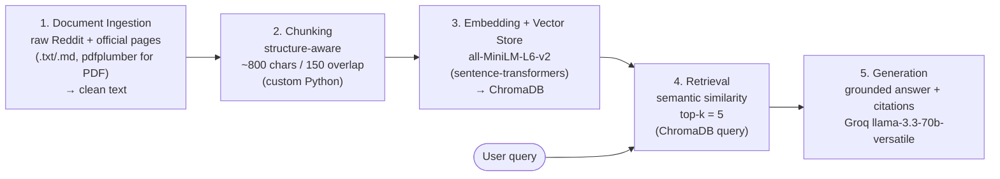

# Project 1 Planning: The Unofficial Guide

> Write this document before you write any pipeline code.
> Your spec and architecture diagram are what you'll use to direct AI tools (Claude, Copilot, etc.) to generate your implementation — the more specific they are, the more useful the generated code will be.
> Update the Retrieval Approach and Chunking Strategy sections if you change your approach during implementation.
> Update this file before starting any stretch features.

---

## Domain

The domain for this project is parking at the Ohio State University. Parking at OSU is run by a private company called CampusParc, and it seems to be focused more on profits than student convenience. Information is scattered throughout the company's site, which makes it hard to take advantage of perks such as off-peak parking and refunds for unused semesters. In addition, there are alternative options such as street parking and city permits, but they do not show up readily in search results. 

---

## Documents

| # | Source | Description | URL or location |
|---|--------|-------------|-----------------|
| 1 | r/OSU — "Parking help please" | General permit/parking advice thread (student Q&A) | https://www.reddit.com/r/OSU/comments/1q45gjx/parking_help_please/ |
| 2 | r/OSU — "What parking permit should I get?" | Permit comparison / "which one is worth it" thread | https://www.reddit.com/r/OSU/comments/1mcrmis/what_parking_permit_should_i_get/ |
| 3 | r/OSU — "South campus parking" | Cheap parking near south campus (covers gym/Jesse Owens area) | https://www.reddit.com/r/OSU/comments/1l8h0ph/south_campus_parking/ |
| 4 | r/OSU — "Parking garage availability" | When/where garages actually have open spots | https://www.reddit.com/r/OSU/comments/1rcujuj/parking_garage_availability/ |
| 5 | r/OSU — "Street parking during school year" | Whether/where free street parking is realistic | https://www.reddit.com/r/OSU/comments/1ld1hw1/street_parking_during_school_year/ |
| 6 | r/OSU — "Public parking help" | City/public parking pass options | https://www.reddit.com/r/OSU/comments/1fvb7j2/public_parking_help/ |
| 7 | r/OSU — "Worth it to appeal parking citation?" | Student consensus on citation appeals | https://www.reddit.com/r/OSU/comments/1lr4cd3/worth_it_to_appeal_parking_citation/ |
| 8 | r/OSU — "Parking tips for someone who doesn't go here" | Summer / visitor / occasional-parking tips | https://www.reddit.com/r/OSU/comments/1ke38zh/parking_tips_for_someone_who_doesnt_go_here/ |
| 9 | CampusParc — Off-Peak Permit Parking | Official: off-peak windows (weekday eves 4pm–3am, weekends), summer & holiday access | https://osu.campusparc.com/find-parking/off-peak-permit-parking/ |
| 10 | CampusParc — Returns, Refunds & Exchanges | Official: how/when permits can be refunded or exchanged | https://osu.campusparc.com/get-a-permit/returns-refunds-exchanges/ |
| 11 | City of Columbus — University District Parking FAQ (PDF) | Official: FAQ on the University District residential street-permit program around campus | https://www.columbus.gov/files/sharedassets/city/v/1/services/ud-website-faq-_updated-6_10_21.pdf |

---

## Chunking Strategy

**Chunk size:** Max 800 characters (~200 tokens) per chunk 

**Overlap:** 150 characters (~1–2 sentences) between sub-chunks of the longer official documents

**Reasoning:**
- The 256-token model ceiling forces small chunks, which is preferred since the documents primarily contain shorter reddit comments. Additionally, `all-MiniLM-L6-v2` truncates anything past 256 tokens, so an 800-char (~200-token) cap keeps every chunk fully inside the embedding window.
- The corpus is two shapes, so chunking is structure-aware, not blind fixed-width.
  - *Reddit threads* are short opinions (1–4 sentences). Each comment becomes its own chunk. Merging adjacent comments would blend conflicting advice ("get the C permit" vs "don't bother, street park") into one vector and pollute retrieval. The OP/question is its own chunk for context. No overlap is needed since reddit comments are kept whole.
  - *Official pages* (CampusParc, City of Columbus) have clear sections. I split by section/heading/paragraph, and only sub-split with the ~800-char cap + 150-char overlap when a section runs long. For these longer official documents, overlap can be necessary since facts can straddle boundaries between sections.

---

## Retrieval Approach

**Embedding model:** `all-MiniLM-L6-v2` via `sentence-transformers`

**Top-k:** 5

**Reasoning for top-k:** Most questions (e.g., the appeal one) are answered by 1–3 chunks, but the synthesis questions ("general tips to save") need several distinct sources pulled together. k=5 is enough to gather corroborating/ conflicting student opinions plus the relevant official rule, without flooding the LLM with off-topic chunks that dilute the grounded answer. Too low (k=1–2) misses corroboration and makes a single bad chunk fatal; too high (k=15) drags in irrelevant chunks the LLM may treat as fact.

**Production tradeoff reflection:**
- **Accuracy on opinion text:** I'd test a stronger model like `all-mpnet-base-v2` (768-dim) or an API model (`text-embedding-3-large`). Short, sarcastic, slangy Reddit opinions are exactly where the small MiniLM model loses nuance.
- **Context length:** MiniLM's 256-token cap forces me to over-chunk the official pages. A long-context embedding model would let me embed whole sections intact, keeping related rules together.
- **Local vs API:** local (current) = free, private, no rate limits, but lower ceiling and uses my CPU/GPU. API = higher accuracy and zero infra, but per-call cost at scale and sending student data to a third party.
- **Multilingual:** not needed — this corpus is all English. I would *not* pay for a multilingual model here.
- **Latency:** local embedding is fine for a small corpus; for thousands of live queries I'd weigh a hosted model or a quantized local one.

---

## Evaluation Plan

| # | Question | Expected answer |
|---|----------|-----------------|
| 1 | I want to work out at Jesse Owens South in the evenings. What are the cheapest parking options? | An **off-peak permit** (cheaper, valid weekday evenings 4pm–3am and weekends per CampusParc #9) is the cheapest legit evening option for the south-campus gym area; plus student-reported cheap south-campus spots from #3. Should cite #9 and #3. |
| 2 | What are the best options for summer parking on north campus? | Summer has relaxed rules — CampusParc allows flexible summer permit purchase / broader access (#9), and student tips in #8 apply. *Coverage is partial — no document is north-campus-summer-specific, so this is a likely partial-accuracy / failure case to document in Milestone 6.* |
| 3 | Can I appeal a citation if I misread a parking sign? | Yes, you can file an appeal (official process exists), but student consensus in #7 is that "I misread/didn't see the sign" is **usually not accepted** as grounds. A correct answer acknowledges both: appealing is possible but unlikely to succeed for this reason. Should cite #7. |
| 4 | What are some general tips to save money on parking at OSU? | Synthesis across sources: off-peak permit (#9), city/University District residential or public parking passes (#6, #11), realistic street parking (#5), south-campus cheap spots (#3). A good answer pulls from multiple docs and attributes each tip. |
| 5 | Can I get a refund if I cancel or return my parking permit? | Per CampusParc Returns/Refunds (#10): refunds/exchanges are allowed under stated conditions (typically prorated, subject to terms). A correct answer states the refund is possible and summarizes the conditions, citing #10. Near-certain pass — tests grounded factual retrieval. |

---

## Anticipated Challenges

1. **Conflicting and outdated student advice.** Reddit threads span different years and disagree (prices and permit availability change annually). Retrieval may surface a 2-year-old price or two contradictory opinions in the same top-k set. Risk: the LLM presents stale or contradictory info as current fact. Mitigation: prompt the LLM to attribute claims to their source and flag disagreement rather than picking one silently.

2. **Source-type attribution (unofficial vs official).** A chunk from a Reddit comment carries far less authority than a CampusParc rule, but to the embedding they look similar. Risk: the system states an unverified student claim ("street parking is totally free on X street") as if it were an official rule. Mitigation: store a `source_type` (reddit / official) in chunk metadata and surface it in citations.

3. **PDF extraction quality (#11).** The Columbus University District FAQ is a PDF; `pdfplumber` does no OCR, so any image-based content extracts as empty or garbled chunks that either pollute the store or silently drop coverage. Mitigation: inspect the extracted text before embedding, and paste the text manually if extraction is poor.

4. **Thin coverage = hallucination on edge queries.** Small corpus means some questions (e.g., north-campus summer, Q2) have weak or no source coverage. Risk: the LLM fills the gap from general knowledge instead of saying "I don't know." Mitigation: instruct the LLM to answer only from retrieved context and explicitly say when the documents don't cover the question.

---

## Architecture

Stages: **Ingestion** (load/clean text) → **Chunking** (custom Python) → **Embedding + Vector Store** (`all-MiniLM-L6-v2` → ChromaDB) → **Retrieval** (top-k=5 semantic search) → **Generation** (Groq `llama-3.3-70b-versatile`, grounded + cited).

---

## AI Tool Plan

**Milestone 3 — Ingestion and chunking:**
- *Input:* my Documents table + Chunking Strategy section + the "structure-aware, ~800 char / 150 overlap, keep Reddit comments whole" rule.
- *Expect it to produce:* a loader that reads files from `documents/`, strips boilerplate (Reddit "Reply/Share/Report" UI text, nav text), and a `chunk_text()` function that splits on natural boundaries and enforces my size/overlap caps, attaching `source` and `source_type` metadata to each chunk.
- *Verify:* spot-check that no chunk exceeds ~800 chars, that each Reddit comment is its own chunk, and that metadata is populated.

**Milestone 4 — Embedding and retrieval:**
- *Input:* my Retrieval Approach section (model = all-MiniLM-L6-v2, store = ChromaDB, top-k=5).
- *Expect it to produce:* code to embed all chunks, persist them to a ChromaDB collection with metadata, and a `retrieve(query, k=5)` function returning chunks + scores + source.
- *Verify:* run my 5 eval questions and inspect whether retrieved chunks are on-topic before adding any generation.

**Milestone 5 — Generation and interface:**
- *Input:* my grounding requirement (answer only from retrieved chunks, always cite sources, say "I don't know" when uncovered) + the Architecture diagram.
- *Expect it to produce:* a Groq `llama-3.3-70b-versatile` call that takes the query + retrieved chunks and returns a grounded answer with source attribution, wrapped in a simple CLI or Streamlit/Gradio interface.
- *Verify:* confirm answers cite real retrieved sources and that the out-of-coverage question (Q2) triggers an "I don't know" rather than a hallucination.
